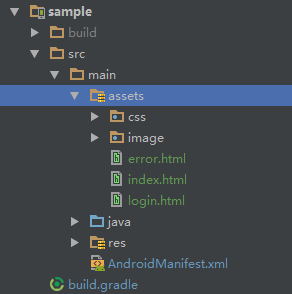
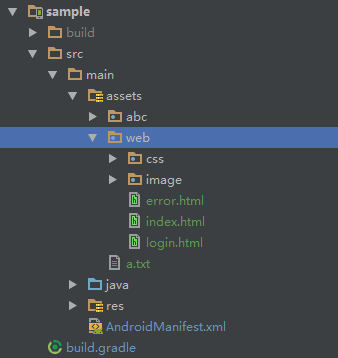

# AndServer-CN
`AndServer`是一个`Android`的`Web`服务器, 支持部署动态网站和静态网站, 支持写`Http`接口，和`Java`的`Servlet`一样。  

QQ技术交流群：547839514  
我的微博：[weibo.com/yanzhenjieit](http://weibo.com/yanzhenjieit)  
我的主页：[www.yanzhenjie.com](http://www.yanzhenjie.com)  
我的博客：[blog.yanzhenjie.com](http://blog.yanzhenjie.com)  

----

# 特点
1. 部署动态网站。
2. 部署静态网站。
3. 动态Http API，就是我们通常说的服务器接口。
4. 接受客户端文件上传。
5. 接受客户端下载文件。
6. 支持高并发。

# 依赖
* Gradle
```groovy
compile 'com.yanzhenjie:andserver:1.0.3'
```

* Maven
```xml
<dependency>
  <groupId>com.yanzhenjie</groupId>
  <artifactId>andserver</artifactId>
  <version>1.0.3</version>
  <type>pom</type>
</dependency>
```

* Eclipse
[Download Jar File](./Jar/andserver.jar?raw=true)

# 使用方法
最好的教程是`sample`，请下载查看，然后结合**README**就更清晰了。

## 创建服务器
```java
AndServer andServer = new AndServer.Build()
    ...
    .build();

// 创建服务器。
Server mServer = andServer.createServer();
...

// 启动服务器。
mServer.start();
...

// 停止服务器。
mServer.stop();
...

// 服务器正在运行吗？
boolean running = mServer.isRunning();
```

## 端口号和响应超时设置
```java
AndServer andServer = new AndServer.Build()
    .port(8080) // 默认是8080，Android平台允许的端口号都可以。
    .timeout(10 * 1000) // 默认10 * 1000毫秒。
    ...
    .build();
...
```

## 部署网站
部署网站是通过`Website`接口，你也可以自己实现这个接口，当然`AndServer`已经提供了两个默认实现：  

* [AssetsWebsite](./andserver/src/main/java/com/yanzhenjie/andserver/website/AssetsWebsite.java)
* [StorageWebsite](./andserver/src/main/java/com/yanzhenjie/andserver/website/StorageWebsite.java)

如果用上面两个实现注册你的网站，那么你的默认首页（`index.html`）是：  
`http://ip:port/`  
`http://ip:port/youPath`  
`http://ip:port/youPath/index.html`  

### 注册网站到AndServer
```java
Website website = new AssetsWebsite(AssetManager, youPath);
// 或者
Website website = new StorageWebsite(youPath);

AndServer andServer = new AndServer.Build()
    ...
    .website(website);
    .build();
```

### AssetsWebsite的使用
如果你的网站在`assets`下，那么你就用`AssetsWebsite`来部署你的网站。  

使用方法是：  
```java
AssetManager mAssetManager = getAssets(); //AssetManager can not be closed.

Website website = new AssetsWebsite(mAssetManager, youPath);
```

* 如果你的网站在`assets`根目录下, 你的`path`就填`""`，比如：  


```java
Website website = new AssetsWebsite(mAssetManager, "");
```

那么你的默认首页访问地址就是：  
`http://ip:port`  
`http://ip:port/index.html`  

那么你的其它页面访问地址是：  
`http://ip:port/login.html`  
`http://ip:port/error.html`  

比如：  
```
http://192.168.1.12:8080/index.html  
http://192.168.1.12:8080/login.html
```

* 如果你的网站根目录在`assets`的子目录下，那么你传入`assets`的相对目录地址就好了比如你的网站在`assets`下`web`目录，例如：  


```java
Website website = new AssetsWebsite(mAssetManager, "web");
```

那么你的默认首页访问地址就是：  
`http://ip:port`  
`http://ip:port/web`  
`http://ip:port/web/index.html`  

那么你的其它页面访问地址是：  
`http://ip:port/web/login.html`  
`http://ip:port/web/error.html`  

例如：  
```
http://192.168.1.12:8080
http://192.168.1.12:8080/web
http://192.168.1.12:8080/web/index.html
http://192.168.1.12:8080/web/index.html  
http://192.168.1.12:8080/web/login.html
```

### StorageWebsite的使用
如果你的网站在`assets`下，那么你就用`StorageWebsite`来部署你的网站，比如你的网站在SD卡下时。

使用方法是：  
```java
Website website = new StorageWebsite(youPath);
```

它很简单，只要传入你的网站的存储目录地址即可，例如你的网站在SD卡下的`www`目录：  
```java
File file = new File(Environment.getExternalStorageDirectory(), "www");
String websiteDirectory = file.getAbsolutePath();

Website website = new StorageWebsite(websiteDirectory);
```

访问地址和`AssetsWebsite`的道理相同。

## Http API
Http API是通过`RequestHandler`接口来注册的，它是一个`java interface`，它和`Java`的`Servlet`一样。  

你需要实现这个接口，然后在`AndServer`注册即可，例如：  
```java
public class RequestLoginHandler implements RequestHandler {

    @Override
    public void handle(HttpRequest req, HttpResponse res, HttpContext con) {
        Map<String, String> params = HttpRequestParser.parse(request);

        // Request params.        
        String userName = params.get("username");
        String password = params.get("password");

        if ("123".equals(userName) && "123".equals(password)) {
            StringEntity stringEntity = new StringEntity("Login Succeed", "utf-8");
            response.setEntity(stringEntity);
        } else {
            StringEntity stringEntity = new StringEntity("Login Failed", "utf-8");
            response.setEntity(stringEntity);
        }
    }
}
```

然后在`AndServer`中注册：  
```java
AndServer andServer = new AndServer.Build()
    ...
    .registerHandler("login", new RequestLoginHandler())
    .build();
```

现在你就得到了一个唯一的访问地址：`http://ip:port/login`, 例如：  
```
http://192.168.1.12:8080/login?username=123&password=123
```

文件下载和文件上传的例子请下载`sample`查看。

## Html表单提交
在`Html`的`form`的`action`中填入你注册`RequestHandler`时的`key`就，然后在`RequestHandler`的`handle(HttpRequest, HttpResponse, HttpContext)`方法就可以获取`form`提交的参数了。  

比如我们上面注册`Login RequestHandler`在`form`中这样使用:  
```html
<form id="form1" method="post" action="login">
...
</form>
```

## 监听服务器的状态
```java
private Server.Listener mListener = new Server.Listener() {
    @Override
    public void onStarted() {
        // 服务器启动成功.
    }

    @Override
    public void onStopped() {
        // 服务器停止了，一般是开发者调用server.stop()才会停止。
    }

    @Override
    public void onError(Exception e) {
        // 服务器启动发生错误，一般是端口被占用。
    }
};

AndServer andServer = new AndServer.Build()
    ...
    .listener(mListener)
    .build();
```

# 我的公众号
我时常会推送一些技术文章和生活趣事，微信搜索**严振杰**或者扫码下方二维码关注我的公众号。  


# License
```text
Copyright 2017 Yan Zhenjie

Licensed under the Apache License, Version 2.0 (the "License");
you may not use this file except in compliance with the License.
You may obtain a copy of the License at

   http://www.apache.org/licenses/LICENSE-2.0

Unless required by applicable law or agreed to in writing, software
distributed under the License is distributed on an "AS IS" BASIS,
WITHOUT WARRANTIES OR CONDITIONS OF ANY KIND, either express or implied.
See the License for the specific language governing permissions and
limitations under the License.
```