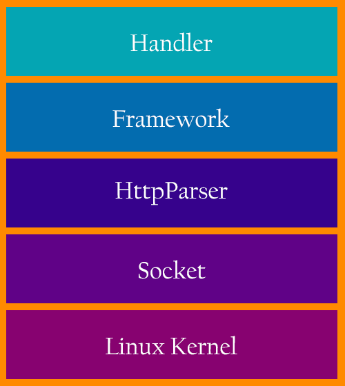

# 概述


AndServer是Android平台的Web Server和Web Framework。 它基于编译时注解提供了类似SpringMVC的注解和功能，如果您熟悉SpringMVC，则可以非常快速地掌握它。

源码地址：[https://github.com/yanzhenjie/AndServer](https://github.com/yanzhenjie/AndServer)  
文档地址：[https://www.yanzhenjie.com/AndServer](https://www.yanzhenjie.com/AndServer)  

## 特性
* 部署静态网站
* 使用注解开发Http Api
* 全局请求拦截器，使用注解，全局多个
* 全局异常处理器，使用注解，全局唯一
* 全局消息转换器，使用注解，全局唯一

## 依赖
添加依赖时请替换下述 **{version}** 字段为[Github](https://github.com/yanzhenjie/AndServer)上公开的最新版本号。
```groovy
dependencies {
    implementation 'com.yanzhenjie.andserver:api:{version}'
    annotationProcessor 'com.yanzhenjie.andserver:processor:{version}'
}
```

## 架构图
系统层架构图  



应用层架构图  


## 流程图
系统层运行时流程图  


应用层运行时流程图  

